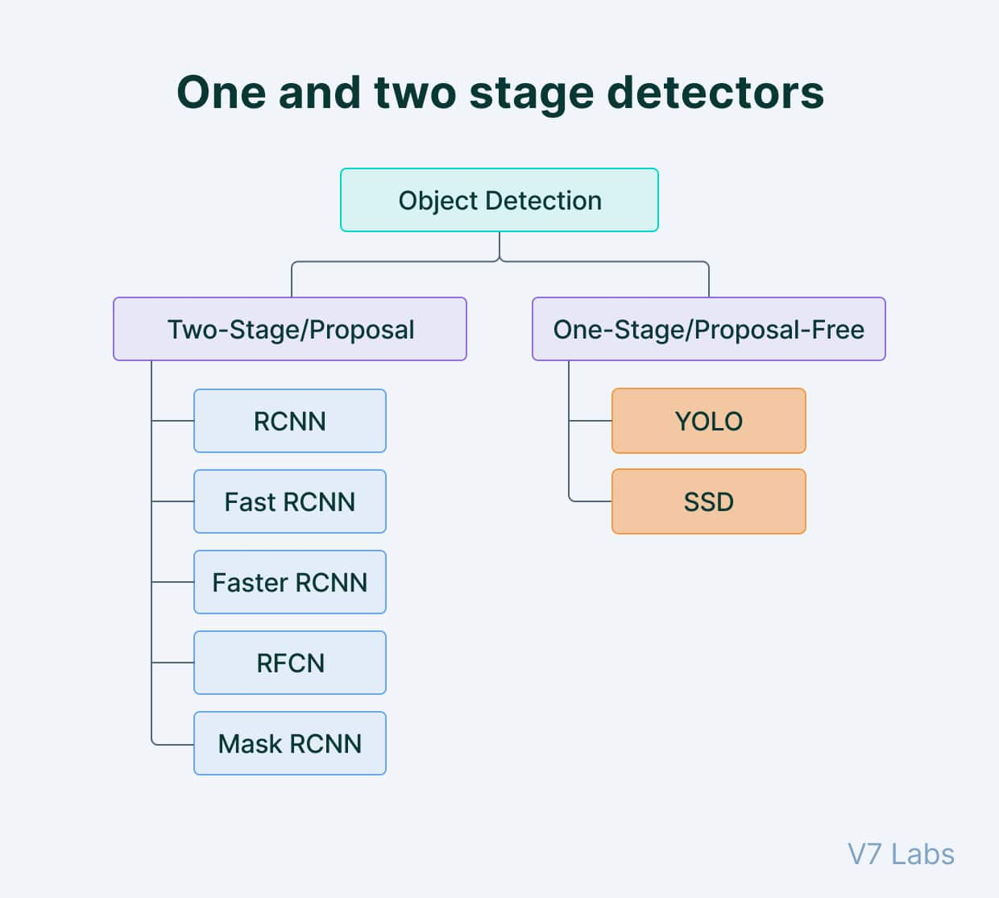
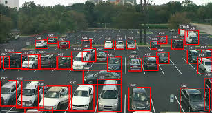

# Real-Time Object Detection using YOLO


## Developer: Yuvraj Singh Chowdhary
[LinkedIn Profile](https://www.linkedin.com/in/yuvraj-singh-chowdhary/)

---

## Overview

This project utilizes YOLO (You Only Look Once), a deep learning algorithm for real-time object detection. YOLO is renowned for its speed and accuracy, making it suitable for applications in video surveillance, self-driving cars, and more. This repository contains the necessary files to run YOLO and detect objects in a live video feed.

---

## Files in the Repository

- **main.py**: Python script for real-time object detection using YOLO.
- **yolov3.weights**: Pre-trained weights file containing the learned network's weights.
- **yolov3.cfg**: Configuration file specifying the network architecture and parameters.
- **coco.names**: Text file listing the names of objects that YOLO can detect.

---

## Project Architecture


The project architecture diagram illustrates the flow of data and processes in the YOLO-based object detection system.

---

## Implementation Flowchart



The flowchart outlines the step-by-step process of implementing real-time object detection using YOLO.

---

## Example Images

### Example 1


Description: Provide a brief description or context for the first example image.

### Example 2



Description: Provide a brief description or context for the second example image.

---

## Setup Instructions

### Environment Setup

1. **Install Dependencies**:
   - Ensure Python is installed. Recommended version: Python 3.x.
   - Install required packages:
     ```bash
     pip install opencv-python opencv-contrib-python pyttsx3
     ```

2. **Download YOLO Files**:
   - Download `yolov3.weights`, `yolov3.cfg`, and `coco.names` files from the repository.

### Running the Object Detection Script

1. **Clone the Repository**:
   ```bash
   git clone https://github.com/your_username/your_repository.git
   cd your_repository
   ```

2. **Run the Object Detection Script**:
   ```bash
   python main.py
   ```
   - Adjust `main.py` if necessary to match your specific camera configuration or input source.

3. **Interacting with the Application**:
   - The application will open a window displaying real-time object detection results.
   - Press `q` to quit the application.

---

## Notes

- Adjust `main.py` script parameters as needed, such as confidence thresholds or input sources.
- Ensure your environment meets the requirements before running the script.
- For further details on YOLO and its applications, refer to the official documentation and research papers.

---

## Contributing

Contributions are welcome! Fork the repository, make your changes, and submit a pull request.

---

## License

This project is licensed under the MIT License - see the [LICENSE](./LICENSE) file for details.

---

## Additional Documentation

For detailed project documentation and report, please refer to the [Project PDF Report](https://www.canva.com/design/DAGH9Oarvr4/ftHBi6LT03XZWElDh1aQXQ/view).
